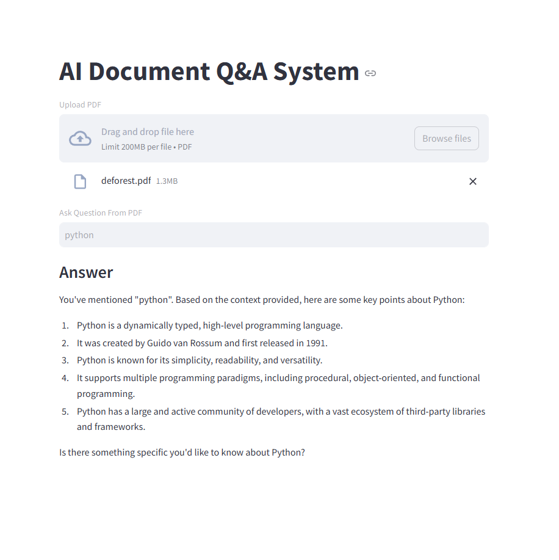

# 📄 AI Document Q&A System (RAG Project)

<div align="center">


<br><br>


</div>

---

# 🚀 Project Overview

AI Document Q&A System is a Retrieval-Augmented Generation (RAG) application that allows users to upload PDF documents and ask questions directly from the uploaded files.

The system processes documents using LangChain, creates vector embeddings using HuggingFace models, stores vectors in FAISS, and generates intelligent answers using Groq LLM.

---

# ✨ Features

✅ Upload PDF Documents
✅ Ask Questions from PDFs
✅ AI-generated Context-Aware Answers
✅ Semantic Search using Vector Embeddings
✅ RAG (Retrieval-Augmented Generation) Workflow
✅ Streamlit Interactive UI
✅ Fast Response using Groq API

---

# 🛠️ Technologies Used

| Technology             | Purpose              |
| ---------------------- | -------------------- |
| Python                 | Backend Development  |
| Streamlit              | Web Interface        |
| LangChain              | RAG Workflow         |
| FAISS                  | Vector Database      |
| HuggingFace Embeddings | Text Embeddings      |
| Groq API               | Large Language Model |
| PyPDF                  | PDF Processing       |

---

# 🧠 RAG Workflow

```text
PDF Upload
   ↓
Text Extraction
   ↓
Text Chunking
   ↓
Embeddings Generation
   ↓
FAISS Vector Storage
   ↓
Semantic Search
   ↓
Groq LLM Answer Generation
```

---

# 📂 Project Structure

```bash
AI-Document-QA/
│
├── app.py
├── output.png
└── README.md
```

---

# 📸 Project Output

## 🖥️ Application Preview

> Upload your project screenshot as `output.png` inside the project folder.

<div align="center">



</div>

---

# 📋 Example Questions

* What is Machine Learning?
* Explain neural networks
* Summarize the document
* What are the key points?

---

# 💡 What I Learned

* Retrieval-Augmented Generation (RAG)
* LangChain Workflow
* Vector Databases using FAISS
* Embeddings & Semantic Search
* Prompt Engineering
* Streamlit UI Development
* Groq API Integration

---

# 👩‍💻 Author

### Chandraprabha A

🚀 Aspiring GenAI Engineer
💻 Passionate about AI & LLM Applications
⚡ Building Real-World GenAI Projects

---

<div align="center">

## ✨ Built with Passion for Generative AI ✨


</div>

